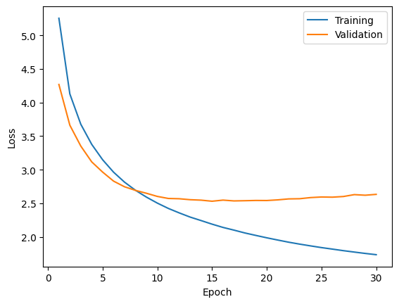

# Translator [en-de]

PyTorch implementation of seq2seq transformer model based on the original [paper](https://arxiv.org/abs/1706.03762). The saved weights for thhe trained model with 24M parameters is used for the end-to-end `EN` to `DE` translator app.

## Table of Contents

* [Model](#model)
* [Dataset](#dataset)
* [Evaluation](#evaluation)
    * [Loss Curves](#loss-curves)
    * [BLEU Score](#bleu-score)
* [Deployment](#deployment)
    * [Docker Compose Deployment](#docker-compose-deployment)


## Model

Implemented a encoder-decoder seq2seq transformer model based on the original paper "Attention Is All You Need".

Code for the model is in [model.py](./app/model.py) (`TransformerModel`).

**Model Config:** \
d<sub>model</sub> = 512 \
d<sub>ff</sub> = 512 \
h = 8 \
N = 3 \
dropout = 0.1

**Parameters:** \
24M trainable parameters

## Dataset

**Raw Data:** Used [multi30k](https://huggingface.co/datasets/bentrevett/multi30k) (bentrevett/multi30k) dataset. \
**Data Splits:** Used pre-defined [train,val,test] splits from the dataset. \
**Tokenizer:** Used [WordLevel](https://huggingface.co/docs/tokenizers/en/api/models#tokenizers.models.WordLevel) model from Hugging Face's [Tokenizers](https://pypi.org/project/tokenizers/) lib for tokenizing texts.

## Evaluation

### Loss Curves

&nbsp;<br>


Selected epoch 15 for early stopping because the validation loss was minimum at that point and it started to stabilize and the rise after that.

**Train loss**: 2.190 \
**Validation loss**: 2.531 \
**Test loss**: 2.570

### BLEU Score

BLEU scores for test set:

|  n_gram |    score |
|--------:|---------:|
|       1 | 0.498014 |
|       2 | 0.387071 |
|       3 | 0.299001 |
|       4 | 0.229406 |

## Deployment

### Docker Compose Deployment

1. Download the model weights file [tf_model_15.pt](https://drive.google.com/file/d/1saHmVyxXdZFFG0YF5z8Z24uyGrVmnoVJ/view?usp=sharing) and place under 'artifacts' directory.

1. Install NVIDIA Container Toolkit following these [steps](https://docs.nvidia.com/datacenter/cloud-native/container-toolkit/latest/install-guide.html).

2. Start app using docker compose:

    ```shell
    # Start app
    docker-compose up -d --build

    # Stop app
    docker-compose down
    ```